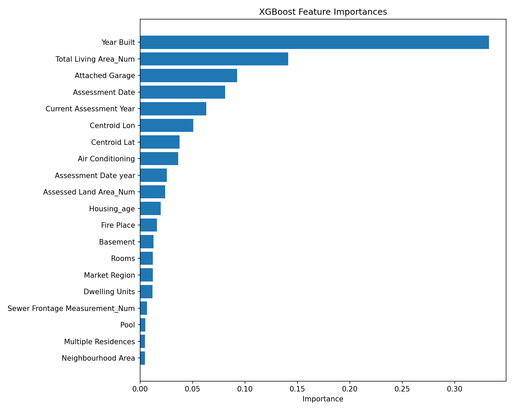
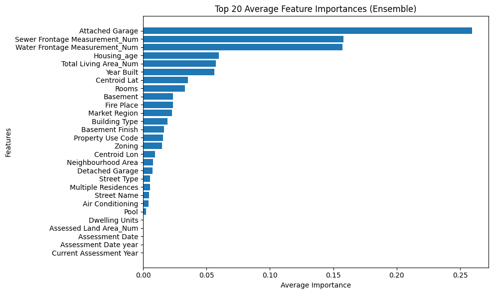

__Opportunity No. 44161__

# Automated Property Valuation Model 

### Overview
An **Automated property Valuation Model (AVM)** was developed using **supervised machine learning** on property characteristic and historical assessment dataset to predict the **assessed market value of residential properties**.  
The model provides a **data-driven fair, consistent, and transparent framework** for estimating property values based on a combination of physical, locational, and historical categorical features.

### Objectives
- To automate the property valuation process using statistical and machine learning methods.  
- To improve the **accuracy**, **efficiency**, and **fairness** of property assessments via interpretable tree-based model usage.  
- To provide an adaptable reproducible modeling pipeline for use by analysts, municipalities, and research teams.

---

### Data Preparation
- Data were preprocessed by handling missing values, removing outliers, scaling numeric features, and encoding categorical variables.  
- Both **Label Encoding** and **One-Hot Encoding** options were implemented and experimented for flexibility.  
- Median / Mode imputation was applied to ensure consistent treatment of missing information.

---

### Machine Learning Approach
- Multiple supervised learning algorithms were implemented, including:
  - Linear Regression (Ridge, Lasso and ElasticNet)
  - Decision Tree Regressor
  - Random Forest Regressor
  - XGBoost Regressor
  - MLP Regressor (Neural Network)
- Each model was evaluated using **R²** and **RMSE** metrics with **Grid Search** and **Randomized Search** for hyperparameter optimization to tailor the model for the provided dataset.

---

### Results
- The **XGBoost model and Random Forest** achieved the highest performance, demonstrating strong predictive accuracy and robustness across diverse property types.  
- The model effectively captured non-linear relationships and trends between property characteristics and assessed values.

---

### Impact
- Enables **automated, fair, data-driven valuation** of properties.  
- Reduces manual workload for assessors and analysts and help them to detect important features for operational decision making.  
- Improves **consistency** and **fairness** in property value estimation across regions.  
- Provides a foundation for future integration into municipal assessment or decision-support systems.

---
# Automated Property Valuation Model

This project predicts the assessed market value of properties using supervised machine learning to make fair market value predictions for residential properties.

### Repository Structure
- **DataUtils** - Handle data loading, pre-processing , outlier detection, feature type detection and ETL pipeline
- **Ensemble Model** - Ensemble of tree based models
- **PropertyEvalModeling V3.ipynb** - Perform exploratory data analysis, pre-processing and train suprevised models for property assesment, justification of modelling approach.
- **plots folder** - Plots - tree, feature importance
- **Reports** - Non technical Summary, Technical Report

## Environment

You will need to install several packages to run the existing code

```python
pip install pandas numpy scipy matplotlib seaborn scikit-learn matplotlib xgboost joblib typing-extensions notebook ipython tqdm statsmodels
```

---

## Model Overview




## Model Comparison Results

| Model | R² | RMSE | Relative to baseline | Relative to Best|
|-------|----|------|--------------|--------------|
| base R LM model	| 0.0034 | 2767000| 0 % | 3.21 % |
| OLS LM model | 0.137 | 3929 | 356.6 % | 14.66 %|
| Linear Regression | 0.784 | 22958 | 2,513 % | 83.86 %|
| Decision Tree Regression | 0.792 | 61192 | 2,541 % | 84.76 %|
| Neural Network Regression | 0.848 | 47734 | 2,727 % | 90.73 %|
| Random Forest Regression| 0.935 | 27394.84 | 2,948 % | 97.83 % |
| XGBoost Regression | 0.934 | 27375.93 | 3,016 % | 100 % |

The **XGBoost model** achieved the highest accuracy, effectively capturing complex relationships between property features and assessed value.

